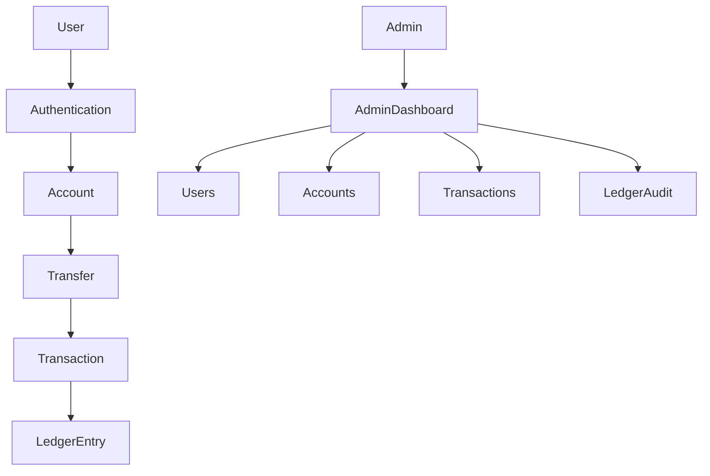

# 🏦 Apex Bank

> A modern banking simulator built with Django and PostgreSQL, designed to demonstrate how real banking systems manage accounts, transfers, statements, and double-entry accounting.


---

## 📖 Overview

Apex Bank is a full-stack banking simulation project inspired by modern fintech platforms such as Revolut, Kuda, Moniepoint, Opay, and Stripe.

The project was built to explore how banking systems work behind the scenes, including:

* Authentication
* Bank account management
* Money transfers
* Transaction history
* Statements
* Administrative operations
* Double-entry ledger accounting

Unlike a simple wallet application, Apex Bank follows banking principles that ensure money cannot be created, destroyed, or moved without a valid audit trail.

---

## ✨ Features

### 👤 Customer Features

* User Registration
* User Login & Logout
* Secure Authentication
* Automatic Account Creation
* Unique Account Number Generation
* Starting Balance Assignment
* Account Dashboard
* Money Transfers
* Transaction History
* Transaction Details
* Account Statements
* Search & Filtering
* Profile Management
* Password Change

### 🏦 Banking Features

* Atomic Transfers
* Balance Validation
* Insufficient Funds Protection
* Self-Transfer Prevention
* Transaction References
* Statement Generation
* Double-Entry Ledger Accounting
* Money Conservation Rules

### 🛡️ Admin Features

* Admin Dashboard
* User Monitoring
* Account Monitoring
* Transaction Monitoring
* Banking Analytics
* Ledger Audit View

---

## 🏗️ System Architecture



---

## 💰 Banking Rules

Apex Bank follows several core banking rules:

* Users cannot spend more than their balance.
* Account balances cannot become negative.
* Money is never created during transfers.
* Money is never destroyed during transfers.
* Every transfer is permanently recorded.
* Every transfer generates ledger entries.
* Every financial operation is executed atomically.

---

## 📒 Double-Entry Ledger

Every successful transfer creates:

```text
1 Transaction
2 Ledger Entries
```

Example:

```text
User A sends ₦500 to User B

DEBIT:
Account A → ₦500

CREDIT:
Account B → ₦500
```

The system enforces:

```text
Total Debits = Total Credits
```

for every transaction.

This approach provides:

* Auditability
* Reconciliation
* Data Integrity
* Financial Accuracy

---

## 🔒 Security Features

* CSRF Protection
* Session-Based Authentication
* Password Hashing
* Ownership Validation
* Protected Admin Routes
* Atomic Database Transactions
* Row-Level Account Locking
* Safe Transfer Processing
* Protected Financial Records
* Secure User Authorization

---

## 🛠 Tech Stack

### Backend

* Python 3.11
* Django 5.2

### Database

* PostgreSQL
* psycopg2-binary
* dj-database-url

### Frontend

* Django Templates
* HTML5
* CSS3
* Bootstrap Icons

### Visualization

* Chart.js

### Authentication

* Django Custom User Model
* Email-Based Login

---

## 📸 Screenshots

Add screenshots here after deployment.

### Login Page

```text
docs/screenshots/login.png
```

### Dashboard

```text
docs/screenshots/dashboard.png
```

### Transfer Page

```text
docs/screenshots/transfer.png
```

### Admin Dashboard

```text
docs/screenshots/admin-dashboard.png
```

---

## 🚀 Installation

### Clone Repository

```bash
git clone https://github.com/Mansur-WP/apex-bank.git
cd apex-bank
```

### Create Virtual Environment

```bash
python -m venv venv
```

### Activate Virtual Environment

Windows:

```bash
venv\Scripts\activate
```

Linux/macOS:

```bash
source venv/bin/activate
```

### Install Dependencies

```bash
pip install -r requirements.txt
```

### Configure Environment Variables

Create a `.env` file:

```env
DATABASE_URL=your_database_url
SESSION_SECRET=your_secret_key
```

### Apply Migrations

```bash
python manage.py migrate
```

### Create Admin User

```bash
python manage.py createsuperuser
```

### Run Development Server

```bash
python manage.py runserver
```

Open:

```text
http://127.0.0.1:8000
```

---

## 🌐 Application Routes

### Authentication

| Route                 | Description   |
| --------------------- | ------------- |
| `/accounts/register/` | Register User |
| `/accounts/login/`    | Login         |
| `/accounts/logout/`   | Logout        |

### Banking

| Route                   | Description         |
| ----------------------- | ------------------- |
| `/dashboard/`           | Dashboard           |
| `/transfers/`           | Transfer Funds      |
| `/transfers/history/`   | Transaction History |
| `/transfers/statement/` | Account Statement   |
| `/transfers/ledger/`    | User Ledger Entries |

### Administration

| Route                      | Description     |
| -------------------------- | --------------- |
| `/admin-dashboard/`        | Admin Dashboard |
| `/transfers/ledger-audit/` | Ledger Audit    |
| `/admin/`                  | Django Admin    |

---

## 🧪 Testing Checklist

### Authentication

* Register User
* Login User
* Logout User
* Invalid Credentials

### Accounts

* Automatic Account Creation
* Unique Account Numbers

### Transfers

* Successful Transfer
* Insufficient Balance
* Invalid Account Number
* Self Transfer Prevention

### Ledger

* Debit Entry Creation
* Credit Entry Creation
* Debit/Credit Equality Validation

### Administration

* Staff Access Validation
* User Monitoring
* Ledger Audit Access

---

## 📈 Development Progress

### Completed

* ✅ Phase 1 — Authentication
* ✅ Phase 2 — Bank Accounts
* ✅ Phase 3 — Transfers
* ✅ Phase 4 — Transaction History
* ✅ Phase 5 — Statements & Filters
* ✅ Phase 6 — Admin Dashboard
* ✅ Phase 7 — Double-Entry Ledger

### Planned

* 🔄 Phase 8 — Audit Trail & Activity Logs
* 🔄 Phase 9 — Notifications System
* 🔄 Phase 10 — REST API
* 🔄 Phase 11 — Fraud Detection Simulator
* 🔄 Phase 12 — Email & PDF Statements

---

## ⚠️ Disclaimer

Apex Bank is a banking simulation project created for educational, research, and portfolio purposes.

This application does not process real money and must not be used for actual financial transactions.

---

## 👨‍💻 Author

**Mansur Nasir**

GitHub:
https://github.com/Mansur-WP

---

## ⭐ Support

If you found this project useful or interesting, consider starring the repository.

It helps others discover the project and supports future development.
