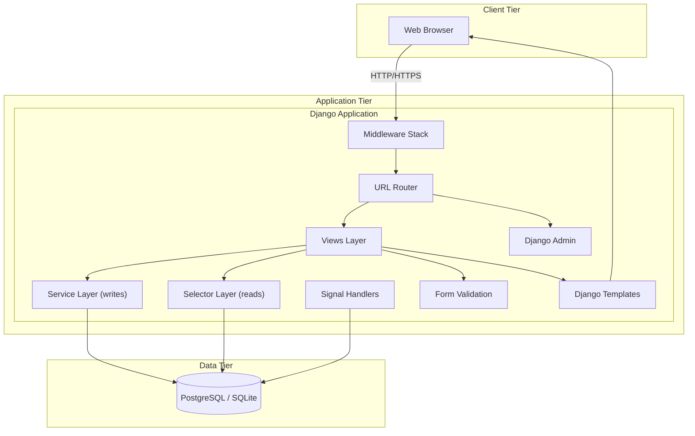
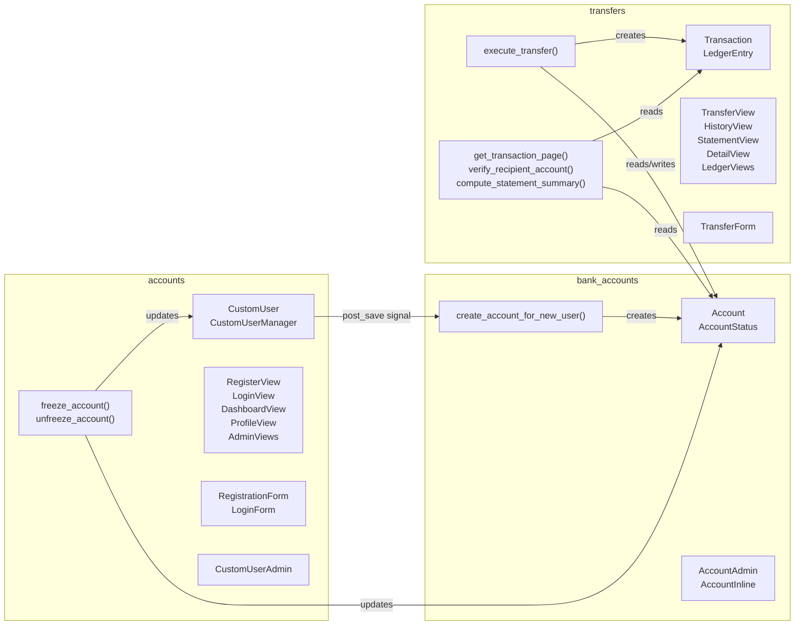
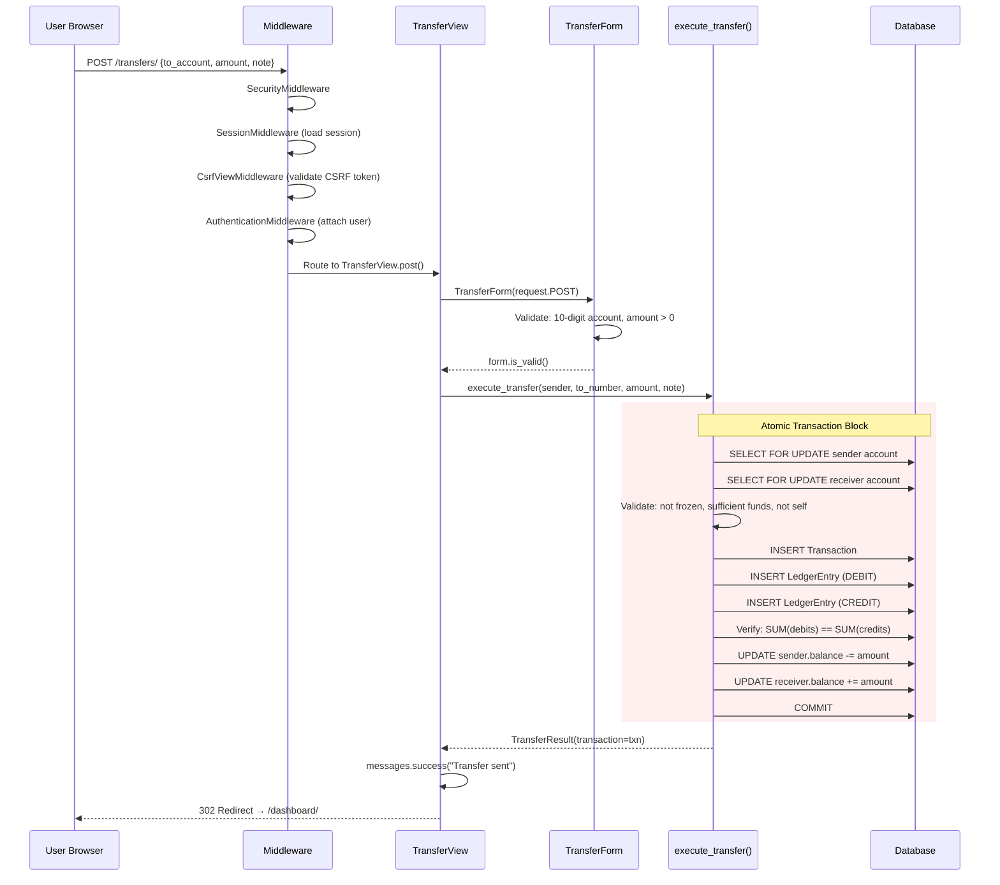
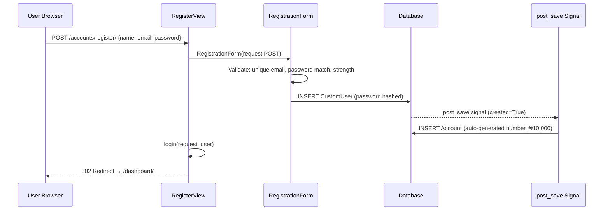
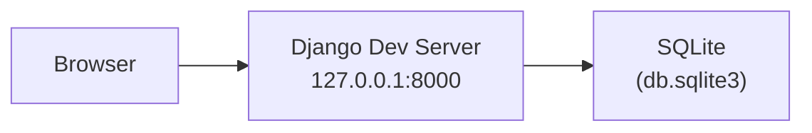
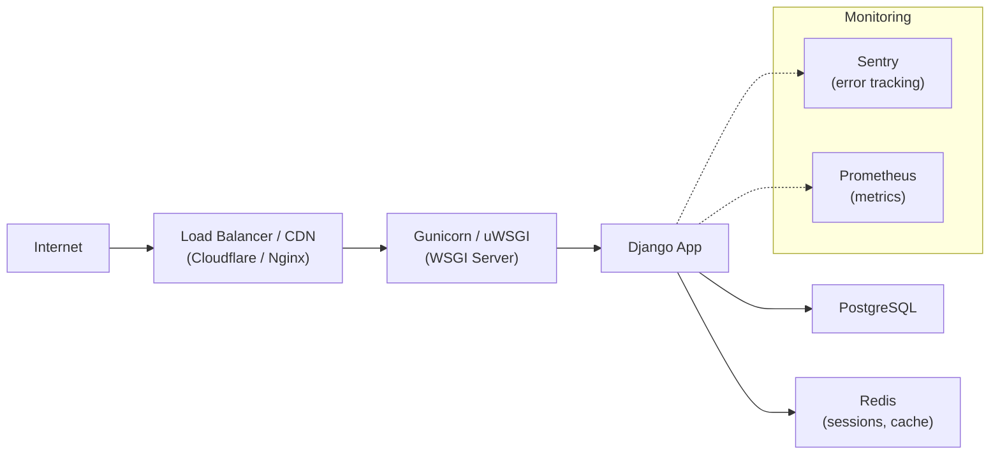

# 🏗️ Apex Bank — System Architecture Document

> **Document Owner:** Principal Solutions Architect  
> **Last Updated:** July 4, 2026  
> **Status:** Living Document  
> **Version:** 1.0 (Phases 1–7)

---

## 1. Architecture Overview

Apex Bank is a **monolithic Django application** following the Model-View-Template (MVT) pattern with an additional **Service/Selector layer** for business logic separation.



---

## 2. Application Modules

### 2.1 Module Map



### 2.2 Module Responsibilities

| Module | Responsibility | Owns |
|---|---|---|
| **`accounts`** | User identity, authentication, admin operations | `CustomUser`, auth views, admin dashboard, freeze/unfreeze |
| **`bank_accounts`** | Financial account management | `Account`, account number generation, auto-creation signal |
| **`transfers`** | Money movement, transaction history, ledger | `Transaction`, `LedgerEntry`, transfer execution, selectors |
| **`banking_project`** | Django configuration, URL routing | `settings.py`, root `urls.py`, WSGI |

### 2.3 Dependency Rules

```
accounts ← bank_accounts ← transfers
    ↑                          |
    └──────────────────────────┘ (via settings.AUTH_USER_MODEL)
```

- `accounts` does **not** import from `bank_accounts` or `transfers` (except for `get_recent_transactions` in dashboard view)
- `bank_accounts` imports from `accounts` only via `settings.AUTH_USER_MODEL`
- `transfers` imports from `bank_accounts` (Account model, AccountStatus)
- Cross-app admin patching is done in `bank_accounts/admin.py` to attach `AccountInline` to `CustomUserAdmin`

---

## 3. Request Lifecycle

### 3.1 Transfer Request Flow



### 3.2 Registration Flow



---

## 4. Technology Stack

### 4.1 Current Stack

| Layer | Technology | Version | Purpose |
|---|---|---|---|
| **Language** | Python | 3.11+ | Server-side application logic |
| **Framework** | Django | 5.2.14 | MVT web framework |
| **Database (Production)** | PostgreSQL | — | ACID-compliant relational database |
| **Database (Development)** | SQLite | — | Zero-config local development |
| **DB Adapter** | psycopg2-binary | 2.9.12 | PostgreSQL Python adapter |
| **DB URL Parser** | dj-database-url | 3.1.2 | Parse `DATABASE_URL` env var |
| **Env Config** | python-dotenv | 1.2.2 | Load `.env` file |
| **Templates** | Django Templates | (built-in) | Server-side HTML rendering |
| **Charts** | Chart.js | (CDN) | Admin dashboard analytics |
| **Icons** | Bootstrap Icons | (CDN) | UI iconography |
| **WSGI** | Django dev server | (built-in) | Development only |

### 4.2 Technology Decisions

| Decision | Choice | Rationale |
|---|---|---|
| Email-based login | `CustomUser` with `USERNAME_FIELD = "email"` | Banking convention — users identify by email, not username |
| Custom User Model | `AbstractBaseUser` + `PermissionsMixin` | Django docs recommend this from day one to avoid painful migration later |
| Service/Selector pattern | `services.py` (writes) + `selectors.py` (reads) | Clean separation of business logic from views; testable without HTTP layer |
| Double-entry ledger | `LedgerEntry` model | Financial audit trail — ensures money conservation |
| `select_for_update()` | Row-level locking | Prevents race conditions on concurrent transfers |
| PK-ordered locking | `order_by("pk")` on locked rows | Prevents deadlocks when two transfers involve the same accounts |
| Session-based auth | Django sessions (DB-backed) | Simplest secure option for server-rendered HTML app |
| `PROTECT` on delete | All financial FKs | Financial records must never be orphaned |
| Signals for account creation | `post_save` on `CustomUser` | Ensures account creation regardless of how user is created (view, admin, CLI) |

---

## 5. URL Architecture

### 5.1 Route Map

```
/                               → 302 → /dashboard/
├── accounts/
│   ├── register/               → RegisterView
│   ├── login/                  → CustomLoginView
│   └── logout/                 → CustomLogoutView
├── dashboard/                  → DashboardView (auth required)
├── profile/
│   ├── (root)                  → ProfileView (auth required)
│   └── password/               → ChangePasswordView (auth required)
├── transfers/
│   ├── (root)                  → TransferView (auth required)
│   ├── verify-recipient/       → VerifyRecipientView (JSON, auth required)
│   ├── history/                → TransactionHistoryView (auth required)
│   ├── statement/              → AccountStatementView (auth required)
│   ├── ledger/                 → MyLedgerEntriesView (auth required)
│   ├── ledger-audit/           → LedgerAuditView (staff only)
│   └── transactions/<ref>/    → TransactionDetailView (auth + ownership)
├── admin-dashboard/
│   ├── (root)                  → AdminDashboardView (staff only)
│   ├── users/                  → AdminUsersView (staff only)
│   ├── transactions/           → AdminTransactionsView (staff only)
│   └── accounts/               → AdminAccountsView (staff only)
└── admin/                      → Django Admin (superuser)
```

### 5.2 Known Issue: Freeze URLs Not Wired

The file `accounts/urls_freeze.py` defines:
```
/freeze/    → FreezeAccountView
/unfreeze/  → UnfreezeAccountView
```

However, this URL module is **not included** in any parent URL configuration (`admin_urls.py` or `banking_project/urls.py`). The freeze/unfreeze views are currently unreachable via HTTP.

---

## 6. Middleware Stack

Middleware processes in order (request) and reverse order (response):

| Order | Middleware | Purpose |
|---|---|---|
| 1 | `SecurityMiddleware` | HTTPS redirects, HSTS headers |
| 2 | `SessionMiddleware` | Load/save session from database |
| 3 | `CommonMiddleware` | URL normalization, content-length |
| 4 | `CsrfViewMiddleware` | CSRF token validation |
| 5 | `AuthenticationMiddleware` | Attach `request.user` from session |
| 6 | `MessageMiddleware` | Flash messages framework |
| 7 | `XFrameOptionsMiddleware` | Clickjacking protection |

> **Note:** `PartitionedCookiesMiddleware` exists in `middleware.py` but is **intentionally not enabled**. It was used for Replit iframe hosting and is retained for reference only.

---

## 7. Deployment Architecture

### 7.1 Current (Development)



### 7.2 Recommended (Production)



### 7.3 Environment Configuration

| Environment | Database | Debug | HTTPS | Session Backend |
|---|---|---|---|---|
| Local Development | SQLite | `True` | No | Database |
| Staging | PostgreSQL | `False` | Yes | Database / Redis |
| Production | PostgreSQL | `False` | Yes | Redis (recommended) |

---

## 8. Future Architecture (Phases 8–12)

### 8.1 Planned Modules

| Phase | Module | Architecture Impact |
|---|---|---|
| 8 | Audit Trail & Activity Logs | New `audit` app, structured logging |
| 9 | Notifications System | New `notifications` app, potentially async (Celery) |
| 10 | REST API | Django REST Framework, token/JWT auth, serializers |
| 11 | Fraud Detection Simulator | New `fraud` app, rule engine, async processing |
| 12 | Email & PDF Statements | Celery tasks, template rendering, file storage |

### 8.2 Architecture Evolution Path

```
Current:  Monolith (Django MVT + Service/Selector)
Phase 10: Monolith + REST API layer (DRF)
Phase 11: Monolith + Background workers (Celery + Redis)
Future:   Consider domain service extraction if team grows
```

> [!TIP]
> The current monolith with Service/Selector pattern is the **right architecture** for this project's scale. Do not prematurely split into microservices. The service layer (`services.py`) already provides the clean boundary needed for future extraction if necessary.
