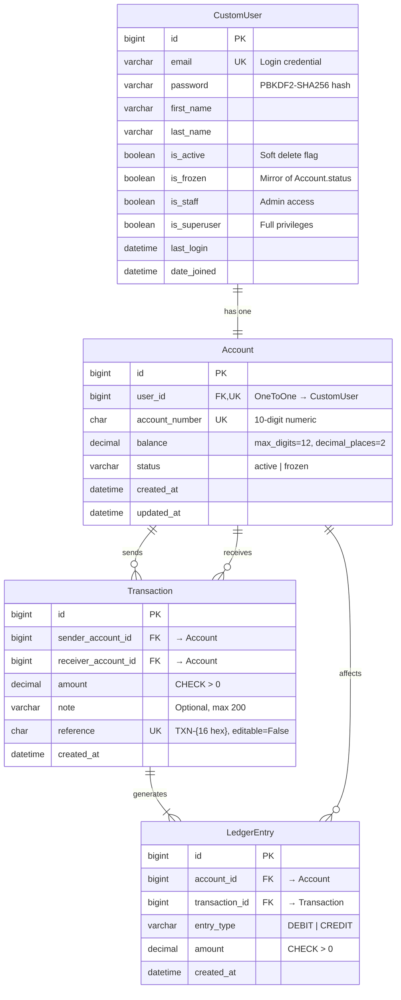
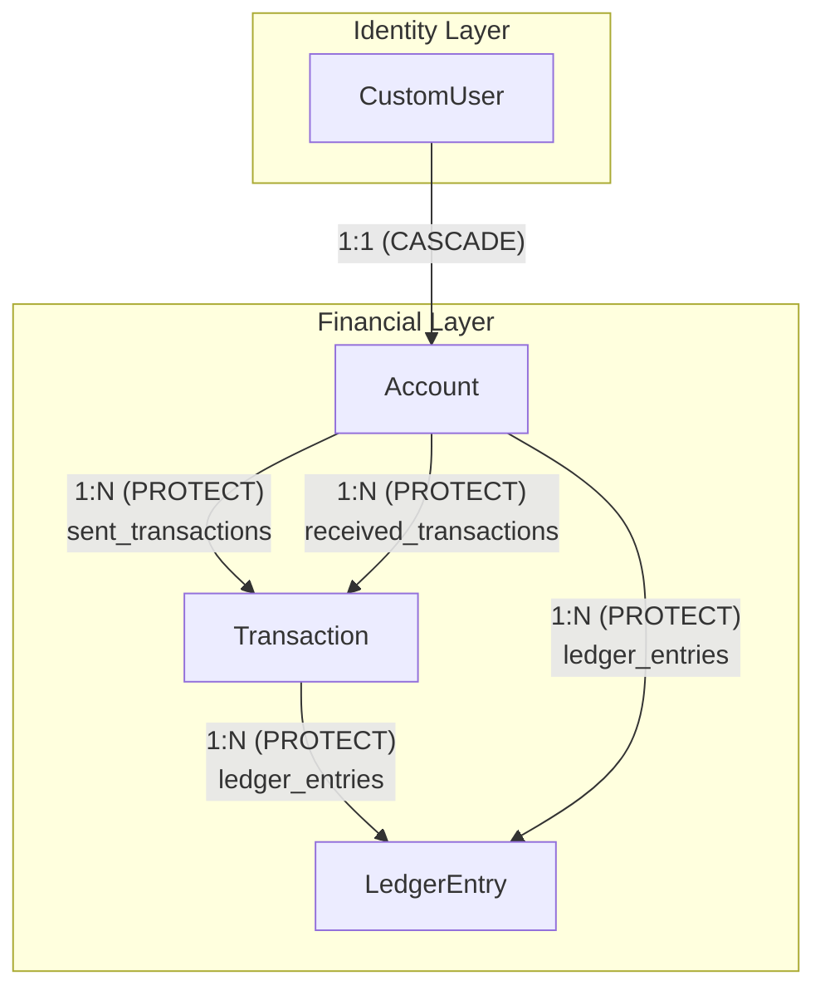

# 🗃️ Apex Bank — Database Schema Documentation

> **Document Owner:** Principal Solutions Architect  
> **Last Updated:** July 4, 2026  
> **Status:** Living Document  
> **Database:** PostgreSQL (production) / SQLite (development)  
> **ORM:** Django 5.2 with `BigAutoField` as default primary key

---

## 1. Entity-Relationship Diagram



---

## 2. Table Specifications

### 2.1 `accounts_customuser`

**Django Model:** `accounts.CustomUser` ([models.py](file:///c:/Users/Py-Craft/Music/Django%20Projets/Apex-Bank/Apex-Bank/banking/accounts/models.py))  
**Purpose:** Primary user identity model. Replaces Django's built-in `User` with email-based authentication.

| Column | Type | Constraints | Default | Notes |
|---|---|---|---|---|
| `id` | `bigint` | PK, auto-increment | — | `BigAutoField` |
| `email` | `varchar(254)` | UNIQUE, NOT NULL | — | Login credential (`USERNAME_FIELD`) |
| `password` | `varchar(128)` | NOT NULL | — | PBKDF2-SHA256 hash |
| `first_name` | `varchar(150)` | NOT NULL | — | Display name |
| `last_name` | `varchar(150)` | NOT NULL | — | Display name |
| `is_active` | `boolean` | NOT NULL | `True` | Soft-delete flag |
| `is_frozen` | `boolean` | NOT NULL, INDEXED | `False` | Mirrors `Account.status` for backward compatibility |
| `is_staff` | `boolean` | NOT NULL | `False` | Admin panel access |
| `is_superuser` | `boolean` | NOT NULL | `False` | Full privilege flag |
| `last_login` | `datetime` | NULLABLE | `NULL` | Auto-updated by Django auth |
| `date_joined` | `datetime` | NOT NULL | `auto_now_add` | Registration timestamp |

**Ordering:** `-date_joined` (newest first)

**Indexes:**
- `email` — UNIQUE index (implicit)
- `is_frozen` — B-tree index (`db_index=True`)

---

### 2.2 `bank_accounts_account`

**Django Model:** `bank_accounts.Account` ([models.py](file:///c:/Users/Py-Craft/Music/Django%20Projets/Apex-Bank/Apex-Bank/banking/bank_accounts/models.py))  
**Purpose:** Financial account linked to a user. Stores balance and account number.

| Column | Type | Constraints | Default | Notes |
|---|---|---|---|---|
| `id` | `bigint` | PK, auto-increment | — | `BigAutoField` |
| `user_id` | `bigint` | FK → `accounts_customuser.id`, UNIQUE, NOT NULL | — | OneToOne relationship |
| `account_number` | `char(10)` | UNIQUE, NOT NULL, `editable=False` | Auto-generated | Random 10-digit numeric |
| `balance` | `decimal(12,2)` | NOT NULL | `10000.00` | Current balance (₦) |
| `status` | `varchar(10)` | NOT NULL, INDEXED | `active` | `active` or `frozen` |
| `created_at` | `datetime` | NOT NULL | `auto_now_add` | Account creation timestamp |
| `updated_at` | `datetime` | NOT NULL | `auto_now` | Last modification timestamp |

**Ordering:** `-created_at` (newest first)

**Indexes:**
- `user_id` — UNIQUE index (implicit from OneToOne)
- `account_number` — UNIQUE index (implicit)
- `status` — B-tree index (`db_index=True`)

**On Delete Behavior:**
- `user_id` → `CASCADE` — if user is deleted, account is deleted

**Auto-generation:**
- `account_number` is generated by `generate_account_number()` on first save — loops until a unique 10-digit string is found

---

### 2.3 `transfers_transaction`

**Django Model:** `transfers.Transaction` ([models.py](file:///c:/Users/Py-Craft/Music/Django%20Projets/Apex-Bank/Apex-Bank/banking/transfers/models.py))  
**Purpose:** Immutable audit record of every completed transfer.

| Column | Type | Constraints | Default | Notes |
|---|---|---|---|---|
| `id` | `bigint` | PK, auto-increment | — | `BigAutoField` |
| `sender_account_id` | `bigint` | FK → `bank_accounts_account.id`, NOT NULL | — | `PROTECT` on delete |
| `receiver_account_id` | `bigint` | FK → `bank_accounts_account.id`, NOT NULL | — | `PROTECT` on delete |
| `amount` | `decimal(12,2)` | NOT NULL, CHECK `> 0` | — | Transfer amount |
| `note` | `varchar(200)` | BLANK OK | `""` | Optional narration |
| `reference` | `char(24)` | UNIQUE, NOT NULL, `editable=False` | `generate_reference()` | Format: `TXN-{16 hex}` |
| `created_at` | `datetime` | NOT NULL | `auto_now_add` | Transfer timestamp |

**Ordering:** `-created_at` (newest first)

**Constraints:**
- `transaction_amount_positive` — CHECK (`amount > 0`)

**Indexes:**
- `reference` — UNIQUE index (implicit)
- `sender_account_id` — FK index
- `receiver_account_id` — FK index

**On Delete Behavior:**
- `sender_account_id` → `PROTECT` — prevents deletion of accounts with transactions
- `receiver_account_id` → `PROTECT` — prevents deletion of accounts with transactions

**Immutability:**
- `reference` is `editable=False`
- Admin `has_add_permission = False`
- Admin `has_change_permission = False`

---

### 2.4 `transfers_ledgerentry`

**Django Model:** `transfers.LedgerEntry` ([models.py](file:///c:/Users/Py-Craft/Music/Django%20Projets/Apex-Bank/Apex-Bank/banking/transfers/models.py))  
**Purpose:** Double-entry ledger row — one DEBIT and one CREDIT per transaction.

| Column | Type | Constraints | Default | Notes |
|---|---|---|---|---|
| `id` | `bigint` | PK, auto-increment | — | `BigAutoField` |
| `account_id` | `bigint` | FK → `bank_accounts_account.id`, NOT NULL | — | `PROTECT` on delete |
| `transaction_id` | `bigint` | FK → `transfers_transaction.id`, NOT NULL | — | `PROTECT` on delete |
| `entry_type` | `varchar(6)` | NOT NULL | — | `DEBIT` or `CREDIT` |
| `amount` | `decimal(12,2)` | NOT NULL, CHECK `> 0` | — | Entry amount |
| `created_at` | `datetime` | NOT NULL | `auto_now_add` | Entry timestamp |

**Ordering:** `-created_at` (newest first)

**Constraints:**
- `ledger_entry_amount_positive` — CHECK (`amount > 0`)

**Indexes:**
- `account_id` — FK index
- `transaction_id` — FK index

**On Delete Behavior:**
- `account_id` → `PROTECT` — prevents deletion of accounts with ledger entries
- `transaction_id` → `PROTECT` — prevents deletion of transactions with ledger entries

---

## 3. Relationship Map



### Key Relationships

| Relationship | Type | From | To | On Delete | Related Name |
|---|---|---|---|---|---|
| User → Account | OneToOne | `CustomUser` | `Account` | CASCADE | `account` |
| Account → Sent Transactions | ForeignKey | `Account` | `Transaction` | PROTECT | `sent_transactions` |
| Account → Received Transactions | ForeignKey | `Account` | `Transaction` | PROTECT | `received_transactions` |
| Transaction → Ledger Entries | ForeignKey | `Transaction` | `LedgerEntry` | PROTECT | `ledger_entries` |
| Account → Ledger Entries | ForeignKey | `Account` | `LedgerEntry` | PROTECT | `ledger_entries` |

---

## 4. Migration History

### 4.1 `accounts` Migrations

| Migration | Description |
|---|---|
| `0001_initial` | Create `CustomUser` model with email-based auth |
| `0002_customuser_is_frozen` | Add `is_frozen` boolean field with db_index |

### 4.2 `bank_accounts` Migrations

| Migration | Description |
|---|---|
| `0001_initial` | Create `Account` model with user FK, account_number, balance |
| `0002_account_status` | Add `status` field (TextChoices: active/frozen) |
| `0003_alter_account_status` | Alter `status` field (add db_index) |

### 4.3 `transfers` Migrations

| Migration | Description |
|---|---|
| `0001_initial` | Create `Transaction` model with sender/receiver FKs |
| `0002_transaction_note` | Add `note` field |
| `0003_transaction_transaction_amount_positive` | Add CHECK constraint on amount > 0 |
| `0004_ledgerentry` | Create `LedgerEntry` model (Phase 7) |

---

## 5. Index Strategy

### 5.1 Current Indexes

| Table | Column(s) | Type | Purpose |
|---|---|---|---|
| `accounts_customuser` | `email` | UNIQUE | Login lookups |
| `accounts_customuser` | `is_frozen` | B-tree | Frozen user queries |
| `bank_accounts_account` | `user_id` | UNIQUE | User-to-account lookups |
| `bank_accounts_account` | `account_number` | UNIQUE | Account lookups during transfer |
| `bank_accounts_account` | `status` | B-tree | Status filtering |
| `transfers_transaction` | `reference` | UNIQUE | Transaction lookup by reference |
| `transfers_transaction` | `sender_account_id` | B-tree | FK index — sent transaction queries |
| `transfers_transaction` | `receiver_account_id` | B-tree | FK index — received transaction queries |
| `transfers_transaction` | `created_at` | B-tree | Ordering (implicit from `ordering = ["-created_at"]`) |
| `transfers_ledgerentry` | `account_id` | B-tree | FK index — per-account ledger queries |
| `transfers_ledgerentry` | `transaction_id` | B-tree | FK index — per-transaction ledger queries |

### 5.2 Recommended Additional Indexes

| Table | Column(s) | Type | Reason |
|---|---|---|---|
| `transfers_transaction` | `(sender_account_id, created_at)` | Composite | Optimize sent transaction history with date filters |
| `transfers_transaction` | `(receiver_account_id, created_at)` | Composite | Optimize received transaction history with date filters |
| `transfers_ledgerentry` | `(account_id, created_at)` | Composite | Optimize per-account ledger view |
| `transfers_ledgerentry` | `(account_id, entry_type)` | Composite | Optimize reconciliation queries |

---

## 6. Data Integrity Rules

### 6.1 Cascade & Protection Strategy

```
CustomUser deletion:
    → Account CASCADE (deleted)
        → Transaction PROTECT (blocked — cannot delete account with transactions)
        → LedgerEntry PROTECT (blocked — cannot delete account with ledger entries)
```

**Result:** Once a user has made or received a transfer, their account (and therefore their user record) **cannot be deleted**. This is intentional — financial records must be preserved.

### 6.2 Recommended Soft-Delete Strategy

Instead of deleting users, use `CustomUser.is_active = False`:
- Prevents login (Django's auth system checks `is_active`)
- Preserves all financial records
- Account number and balance remain for audit purposes

---

## 7. Backup Strategy (Recommended)

### 7.1 Development (SQLite)

```bash
# Simple file copy
cp banking/db.sqlite3 backups/db-$(date +%Y%m%d-%H%M%S).sqlite3
```

### 7.2 Production (PostgreSQL)

```bash
# Full backup
pg_dump -Fc apex_bank > backups/apex_bank_$(date +%Y%m%d).dump

# Restore
pg_restore -d apex_bank backups/apex_bank_20260704.dump
```

### 7.3 Recommended Schedule

| Backup Type | Frequency | Retention |
|---|---|---|
| Full database dump | Daily | 30 days |
| Transaction log (WAL) | Continuous | 7 days |
| Point-in-time recovery | Enabled | 7 days |

---

## 8. Known Limitations

| Limitation | Impact | Resolution Path |
|---|---|---|
| SQLite in development doesn't support `SELECT FOR UPDATE` | Row-level locking is a no-op in dev — race conditions not testable | Use PostgreSQL for integration/staging environments |
| No database-level constraint for `balance >= 0` | Overdraft prevention is application-level only | Add CHECK constraint: `balance >= 0` |
| `account_number` generation uses `random.choices` | Not cryptographically secure; potential (extremely rare) collision during race | Use `secrets.choice` and handle `IntegrityError` on unique violation |
| `max_digits=12` on amount fields | Maximum ₦9,999,999,999.99 per transfer | Sufficient for simulator; increase for production |
