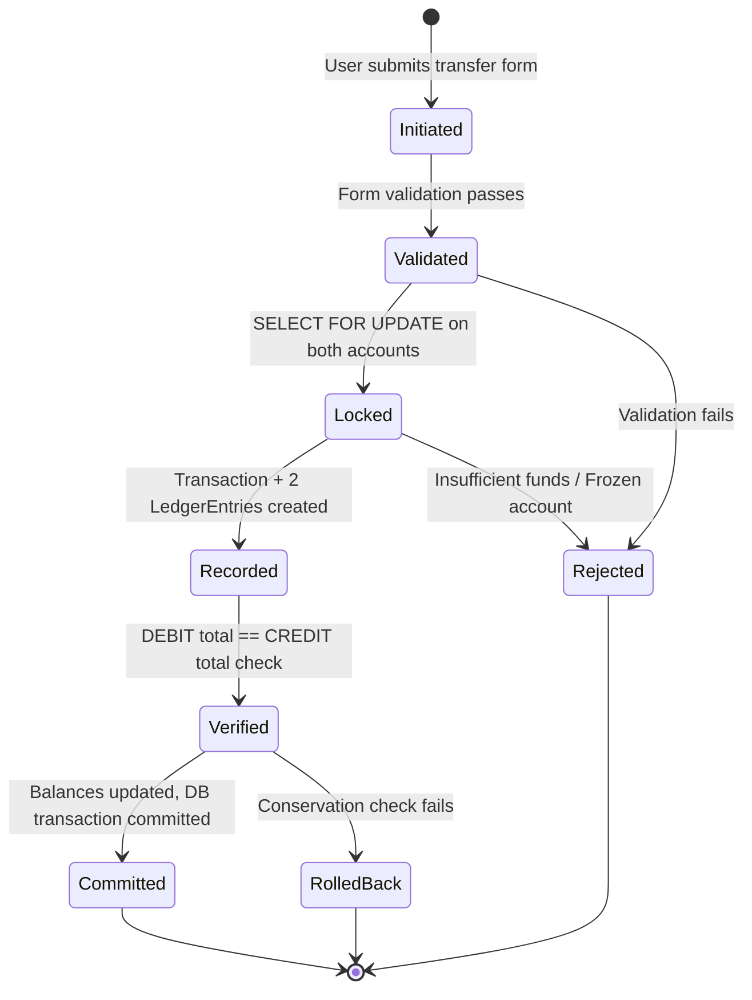

# 📒 Apex Bank — Ledger Specification

> **Document Owner:** Staff Fintech Engineer  
> **Last Updated:** July 4, 2026  
> **Status:** Living Document  
> **Applies To:** Apex Bank v1.0 (Phase 7+)

---

## 1. Overview

Apex Bank uses a **double-entry bookkeeping** system to track every financial movement. Every transfer creates exactly two ledger entries — a DEBIT for the sender and a CREDIT for the receiver — ensuring that money is never created or destroyed within the system.

This specification formalizes the ledger's accounting model, posting rules, reconciliation strategy, and planned extensions.

---

## 2. Accounting Model

### 2.1 Fundamental Principle

```
For every Transaction T:
    Sum(DEBIT entries for T) == Sum(CREDIT entries for T)
```

This is the **conservation invariant** — it is enforced programmatically in `transfers/services.py` after every transfer, and violations cause a full transaction rollback.

### 2.2 Entry Types

| Type | Meaning | Effect on Account |
|---|---|---|
| **DEBIT** | Money leaving the account | Balance decreases |
| **CREDIT** | Money entering the account | Balance increases |

> [!NOTE]
> Apex Bank uses a **simplified banking convention** where DEBIT = outflow and CREDIT = inflow from the account holder's perspective. In full-scale accounting (GAAP/IFRS), debit/credit semantics vary by account type (asset, liability, equity, revenue, expense). This simplified model is sufficient for a wallet/transfer system.

---

## 3. Chart of Accounts

### 3.1 Current Account Types

Apex Bank currently operates with a **single account type** — customer wallet accounts.

| Account Code | Account Type | Normal Balance | Description |
|---|---|---|---|
| `1000` | **Customer Wallet** | Debit | Individual user's bank account. One per user. |

### 3.2 Planned Account Types (Future Phases)

| Account Code | Account Type | Normal Balance | Purpose |
|---|---|---|---|
| `2000` | **System Revenue** | Credit | Collects transfer fees (when implemented) |
| `2100` | **System Suspense** | Debit | Holds funds during pending/disputed transactions |
| `3000` | **System Reserve** | Credit | Starting balance reserve (the ₦10,000 per new user) |
| `4000` | **Fee Revenue** | Credit | Transfer fee income |

> [!IMPORTANT]
> Currently, the starting balance of ₦10,000.00 per new account is **created from nothing** (set as a default on `Account.balance`). In a production system, this should be modeled as a transfer from a System Reserve account to the new Customer Wallet, with corresponding ledger entries.

---

## 4. Posting Rules

### 4.1 Wallet-to-Wallet Transfer

**Trigger:** User initiates a transfer via `POST /transfers/`

**Preconditions:**
1. Sender account is not frozen (`Account.status != FROZEN`)
2. Sender has sufficient balance (`balance >= amount`)
3. Receiver account exists and is different from sender
4. Amount is greater than zero

**Posting:**

```
Transaction T:
    sender_account  = Account A (sender)
    receiver_account = Account B (receiver)
    amount          = X
    reference       = TXN-{uuid16}

Ledger Entry 1 (DEBIT):
    account     = A
    transaction = T
    entry_type  = DEBIT
    amount      = X

Ledger Entry 2 (CREDIT):
    account     = B
    transaction = T
    entry_type  = CREDIT
    amount      = X

Balance Updates:
    A.balance -= X
    B.balance += X
```

**Post-condition:** `Sum(DEBIT for T) == Sum(CREDIT for T) == X`

### 4.2 Account Creation (Current — Implicit)

**Trigger:** New user registration (via `post_save` signal)

```
Account created:
    user            = new_user
    account_number  = random 10-digit number
    balance         = ₦10,000.00 (default)
    status          = ACTIVE
```

> **No ledger entries are created.** The starting balance is an implicit system grant.

### 4.3 Account Creation (Recommended — Explicit)

```
System Reserve Account → New Customer Account

Transaction T:
    sender_account   = System Reserve (3000)
    receiver_account = New Customer (1000)
    amount           = ₦10,000.00

Ledger Entry 1 (DEBIT):
    account     = System Reserve
    entry_type  = DEBIT
    amount      = ₦10,000.00

Ledger Entry 2 (CREDIT):
    account     = New Customer
    entry_type  = CREDIT
    amount      = ₦10,000.00
```

---

## 5. Journal Entries

### 5.1 Journal Entry Structure

Each transfer produces one **journal entry** consisting of:

| Component | Model | Cardinality |
|---|---|---|
| Header | `Transaction` | 1 per transfer |
| Lines | `LedgerEntry` | 2 per transfer (1 DEBIT + 1 CREDIT) |

### 5.2 Journal Entry Lifecycle



### 5.3 Immutability

All journal entries are **immutable** once committed:

- `Transaction.reference` is `editable=False`
- `Transaction` admin has `has_add_permission = False`, `has_change_permission = False`
- Both `Transaction` and `LedgerEntry` use `on_delete=PROTECT` on foreign keys
- No update or delete operations exist in the codebase for these models

---

## 6. Balance Calculation

### 6.1 Dual Balance Tracking

Apex Bank maintains account balances in **two** places:

| Source | Location | Updated By |
|---|---|---|
| **Materialized Balance** | `Account.balance` field | `execute_transfer()` — decrements sender, increments receiver |
| **Derived Balance** | Computed from `LedgerEntry` records | Not currently computed at runtime |

### 6.2 Materialized Balance Formula

```
Account.balance = Starting Balance (₦10,000)
                  - Sum(DEBIT entries for this account)
                  + Sum(CREDIT entries for this account)
```

### 6.3 Reconciliation Query (Recommended)

To verify that the materialized balance matches the ledger:

```sql
SELECT
    a.account_number,
    a.balance AS materialized_balance,
    10000.00
        - COALESCE(SUM(CASE WHEN le.entry_type = 'DEBIT' THEN le.amount END), 0)
        + COALESCE(SUM(CASE WHEN le.entry_type = 'CREDIT' THEN le.amount END), 0)
    AS derived_balance
FROM bank_accounts_account a
LEFT JOIN transfers_ledgerentry le ON le.account_id = a.id
GROUP BY a.id, a.account_number, a.balance
HAVING a.balance !=
    10000.00
        - COALESCE(SUM(CASE WHEN le.entry_type = 'DEBIT' THEN le.amount END), 0)
        + COALESCE(SUM(CASE WHEN le.entry_type = 'CREDIT' THEN le.amount END), 0);
```

**Expected result:** Zero rows (all balances match). Any rows returned indicate a data integrity issue.

> [!WARNING]
> The starting balance of ₦10,000.00 is hardcoded as a constant in this query. If the default balance changes or system-credited amounts are introduced, this query must be updated. A better long-term solution is to model the starting balance as an explicit ledger entry (see Section 4.3).

---

## 7. Transaction Reference System

### 7.1 Format

```
TXN-{16 hex characters uppercase}
```

**Example:** `TXN-3F8A1C4B9D2E7F01`

### 7.2 Properties

| Property | Value |
|---|---|
| Generator | `uuid.uuid4().hex[:16].upper()` |
| Length | 20 characters (4 prefix + 16 hex) |
| Uniqueness | Enforced by `unique=True` on model field |
| Mutability | `editable=False` — cannot be changed after creation |
| Collision probability | ~1 in 18 quintillion (2^64) — negligible |

---

## 8. Constraints & Invariants

### 8.1 Database-Level Constraints

| Constraint | Table | Type | Definition |
|---|---|---|---|
| `transaction_amount_positive` | `transfers_transaction` | CHECK | `amount > 0` |
| `ledger_entry_amount_positive` | `transfers_ledgerentry` | CHECK | `amount > 0` |
| Unique reference | `transfers_transaction` | UNIQUE | `reference` must be unique |
| Unique account number | `bank_accounts_account` | UNIQUE | `account_number` must be unique |

### 8.2 Application-Level Invariants

| Invariant | Enforcement Point | Consequence of Violation |
|---|---|---|
| **Conservation:** Debits == Credits per transaction | `execute_transfer()` post-check | Transaction rolled back, `TransferError` raised |
| **No overdraft:** Balance >= 0 | `execute_transfer()` pre-check | `InsufficientFundsError` raised |
| **No self-transfer** | `execute_transfer()` pre-check | `SelfTransferError` raised |
| **Frozen sender blocked** | `execute_transfer()` pre-check | `TransferError` raised |
| **System-wide money supply constant** | Tested in `test_money_conservation_across_system` | Test failure |

---

## 9. Reversals & Refunds (Not Yet Implemented)

### 9.1 Recommended Reversal Strategy

Reversals should **never** delete or modify existing ledger entries. Instead, create a **counter-transaction**:

```
Original Transfer:
    A → B: ₦500 (TXN-ORIGINAL)
    DEBIT  A ₦500
    CREDIT B ₦500

Reversal:
    B → A: ₦500 (TXN-REVERSAL, linked to TXN-ORIGINAL)
    DEBIT  B ₦500
    CREDIT A ₦500
```

### 9.2 Recommended Model Extension

```python
class Transaction(models.Model):
    # ... existing fields ...
    
    # Reversal support
    reversed_by = models.OneToOneField(
        "self", null=True, blank=True,
        on_delete=models.PROTECT,
        related_name="reversal_of",
    )
    status = models.CharField(
        max_length=10,
        choices=[("completed", "Completed"), ("reversed", "Reversed")],
        default="completed",
    )
```

---

## 10. Fees (Not Yet Implemented)

### 10.1 Recommended Fee Model

```
Transfer of ₦500 with 1% fee (₦5):

Transaction T:
    amount = ₦500

Ledger Entries:
    DEBIT   Sender       ₦505  (transfer + fee)
    CREDIT  Receiver     ₦500  (transfer only)
    CREDIT  Fee Revenue  ₦5    (fee)

Conservation: 505 == 500 + 5 ✓
```

### 10.2 Fee Schedule (Recommended)

| Transfer Range | Fee | Cap |
|---|---|---|
| ₦1 – ₦5,000 | Free | — |
| ₦5,001 – ₦50,000 | ₦10 flat | — |
| ₦50,001+ | ₦25 flat | ₦25 |

---

## 11. Auditing

### 11.1 Existing Audit Capabilities

| Capability | Implementation | Access |
|---|---|---|
| Per-user ledger view | `MyLedgerEntriesView` at `/transfers/ledger/` | Customer (own entries only) |
| System-wide ledger audit | `LedgerAuditView` at `/transfers/ledger-audit/` | Staff only |
| Admin transaction list | `AdminTransactionsView` at `/admin-dashboard/transactions/` | Staff only |
| Django admin | Transaction/LedgerEntry admin views | Superuser |

### 11.2 Missing Audit Capabilities

| Capability | Priority | Description |
|---|---|---|
| Reconciliation report | High | Compare `Account.balance` to sum of ledger entries |
| Daily closing report | Medium | Net debits/credits per day |
| Admin action audit trail | Critical | Log who froze/unfroze accounts, when |
| Export to CSV/PDF | Medium | Downloadable statements and audit reports |
