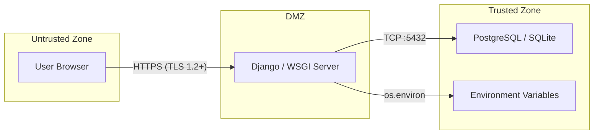

# 🛡️ Apex Bank — Security Threat Model

> **Document Owner:** Security Architect  
> **Last Updated:** July 4, 2026  
> **Status:** Living Document — Review Quarterly  
> **Applies To:** Apex Bank v1.0 (Phases 1–7)

---

## 1. Overview

This document defines the security architecture, threat model, and mitigation strategy for Apex Bank — a Django-based banking simulator that processes simulated financial transfers with double-entry ledger accounting.

> [!CAUTION]
> Apex Bank is an **educational/portfolio** project. It must NOT process real money. If this project transitions to production, a professional security audit and penetration test are mandatory before launch.

### 1.1 Security Objectives

| Objective | Description |
|---|---|
| **Confidentiality** | User credentials, account balances, and transaction data are accessible only to authorized users |
| **Integrity** | Money cannot be created, destroyed, or moved without a valid audit trail (double-entry conservation) |
| **Availability** | The system remains operational under normal load; no single user action can degrade the system |
| **Non-repudiation** | Every financial operation is permanently recorded with timestamps and references |
| **Accountability** | Admin actions (freeze/unfreeze) are attributable to the acting staff member |

---

## 2. System Boundary

### 2.1 Trust Zones



### 2.2 Assets

| Asset | Classification | Storage |
|---|---|---|
| User passwords | **Critical** | Hashed (PBKDF2 via Django) — never stored in plaintext |
| Email addresses | **Sensitive PII** | `accounts_customuser.email` |
| Account numbers | **Sensitive** | `bank_accounts_account.account_number` |
| Account balances | **Sensitive Financial** | `bank_accounts_account.balance` |
| Transaction records | **Sensitive Financial** | `transfers_transaction` table |
| Ledger entries | **Sensitive Financial** | `transfers_ledgerentry` table |
| Session tokens | **Critical** | Server-side session store (DB-backed) |
| SECRET_KEY | **Critical** | Environment variable `SESSION_SECRET` |
| DATABASE_URL | **Critical** | Environment variable |

---

## 3. Authentication

### 3.1 Current Implementation

| Feature | Implementation | Status |
|---|---|---|
| Login credential | Email address (`USERNAME_FIELD = "email"`) | ✅ Implemented |
| Password hashing | Django default: PBKDF2-SHA256 with 870,000 iterations | ✅ Implemented |
| Password validation | 4 validators: UserAttribute, MinLength, Common, Numeric | ✅ Implemented |
| Session backend | Database-backed sessions (`django.contrib.sessions`) | ✅ Implemented |
| CSRF protection | Token-in-session (`CSRF_USE_SESSIONS = True`) | ✅ Implemented |
| Auto-login on registration | `login()` called in `RegisterView.form_valid()` | ✅ Implemented |
| Brute-force protection | Django's `AuthenticationForm` built-in rate limiting | ⚠️ Default only |

### 3.2 Current Gaps

| Gap | Risk | Recommended Mitigation |
|---|---|---|
| No session timeout | Medium | Set `SESSION_COOKIE_AGE = 1800` (30 minutes) |
| No concurrent session limit | Medium | Implement session-per-device tracking |
| No account lockout after N failures | High | Add `django-axes` or custom lockout after 5 failed attempts |
| No email verification | Medium | Require email confirmation before account activation |
| No password reset flow | Medium | Implement Django's `PasswordResetView` chain |
| No 2FA/MFA | High (if production) | Add TOTP-based 2FA for sensitive operations |

### 3.3 Password Security

```
Algorithm: PBKDF2-SHA256
Iterations: 870,000 (Django 5.2 default)
Salt: Random per-password (auto-managed by Django)
Storage: Never plaintext — django.contrib.auth.hashers.PBKDF2PasswordHasher
```

---

## 4. Authorization

### 4.1 Role Model

| Role | Identifier | Privileges |
|---|---|---|
| **Anonymous** | Not authenticated | Access login, register pages only |
| **Customer** | `is_authenticated = True, is_staff = False` | View own dashboard, make transfers, view own transactions/ledger/statement, manage profile |
| **Staff/Admin** | `is_staff = True` | All customer privileges + admin dashboard, user monitoring, account monitoring, transaction monitoring, ledger audit, freeze/unfreeze accounts |
| **Superuser** | `is_superuser = True` | All privileges + Django admin panel |

### 4.2 Access Control Implementation

| Mechanism | Used By | Enforcement Point |
|---|---|---|
| `LoginRequiredMixin` | All authenticated views | View class mixin — returns 302 to login |
| `UserPassesTestMixin` | Admin views, ledger audit | View class mixin — returns 403 if `test_func()` fails |
| `@login_required` | N/A (not currently used) | — |
| Ownership validation | Transaction detail, ledger entries | Selector layer — `get_transaction_for_account()` returns 404 if user not party to transaction |
| Staff check in service | Freeze/unfreeze actions | `admin_actions.py` — `getattr(acting_user, "is_staff", False)` raises `PermissionError` |

### 4.3 Current Gaps

| Gap | Risk | Recommended Mitigation |
|---|---|---|
| No RBAC framework | Medium | Consider `django-guardian` for object-level permissions if roles grow beyond staff/customer |
| No permission granularity | Low | Current staff/non-staff binary is sufficient for simulator scope |
| Freeze URL routes not wired into `admin_urls.py` | High | The `urls_freeze.py` exists but is not included in any URL configuration — freeze/unfreeze may be unreachable via the admin dashboard |

---

## 5. Transport Security

### 5.1 Current Implementation

| Feature | Configuration | File |
|---|---|---|
| HTTPS proxy support | `SECURE_PROXY_SSL_HEADER = ("HTTP_X_FORWARDED_PROTO", "https")` | `settings.py` |
| Forwarded host | `USE_X_FORWARDED_HOST = True` | `settings.py` |
| Session cookie secure | `SESSION_COOKIE_SECURE = True` (production) / `False` (local dev) | `settings.py` |
| Session cookie SameSite | `SESSION_COOKIE_SAMESITE = "Lax"` | `settings.py` |
| CSRF trusted origins | Explicit allowlist via `APP_CSRF_TRUSTED_ORIGINS` env var | `settings.py` |

### 5.2 Production Hardening Required

| Setting | Recommended Value | Purpose |
|---|---|---|
| `SECURE_SSL_REDIRECT` | `True` | Force HTTPS |
| `SECURE_HSTS_SECONDS` | `31536000` (1 year) | HTTP Strict Transport Security |
| `SECURE_HSTS_INCLUDE_SUBDOMAINS` | `True` | Cover all subdomains |
| `SECURE_CONTENT_TYPE_NOSNIFF` | `True` | Prevent MIME-type sniffing |
| `SECURE_BROWSER_XSS_FILTER` | `True` | Enable browser XSS filter |
| `X_FRAME_OPTIONS` | `"DENY"` | Prevent clickjacking |

---

## 6. Input Validation & Injection

### 6.1 CSRF Protection

- **Status:** ✅ Enabled globally via `CsrfViewMiddleware`
- **Token storage:** Server-side session (`CSRF_USE_SESSIONS = True`)
- **Trusted origins:** Explicit allowlist per environment

### 6.2 SQL Injection

- **Status:** ✅ Mitigated by Django ORM
- **Details:** All database queries use Django ORM parameterized queries. No raw SQL is used anywhere in the codebase.

### 6.3 XSS (Cross-Site Scripting)

- **Status:** ✅ Mitigated by Django template auto-escaping
- **Details:** All user-facing output is rendered through Django templates, which auto-escape by default. No `|safe` or `mark_safe()` usage on user input.

### 6.4 Form Validation

| Form | Validation Layer | Details |
|---|---|---|
| `RegistrationForm` | Model + Form | Email uniqueness (DB), password match, password strength (4 validators) |
| `LoginForm` | `AuthenticationForm` | Credential verification, brute-force protection |
| `TransferForm` | Form + Service | Account number format (10 digits), amount > 0, service-layer validation (balance, self-transfer, account existence, frozen status) |

---

## 7. Financial Security

### 7.1 Atomicity

All financial operations use `django.db.transaction.atomic()` to ensure:
- Balance deductions and credits happen in a single database transaction
- If any step fails, the entire operation is rolled back
- No partial transfers can occur

### 7.2 Row-Level Locking

```python
Account.objects.select_for_update().filter(pk__in=[...]).order_by("pk")
```

- `select_for_update()` acquires row-level locks on both sender and receiver accounts
- Accounts are locked in primary-key order to **prevent deadlocks**
- Locks are held for the duration of the atomic block

> [!WARNING]
> `select_for_update()` is a **no-op on SQLite**. The development database (SQLite) does not enforce row-level locking. This means concurrent transfer tests in development may not catch race conditions that would occur in PostgreSQL production.

### 7.3 Double-Entry Conservation

After creating ledger entries, the transfer service verifies:

```python
debit_total == credit_total  # Must be True for every transaction
```

If this check fails, the entire transaction is rolled back. This is the **final financial safety net**.

### 7.4 Immutability

| Record | Protection Mechanism |
|---|---|
| `Transaction` | `editable=False` on reference, `PROTECT` on delete, admin disables add/change |
| `LedgerEntry` | `PROTECT` on delete, created only by `execute_transfer()` |
| `Account.account_number` | `editable=False` on model field |

---

## 8. Threat Model (STRIDE)

### 8.1 Spoofing (Identity)

| Threat | Likelihood | Impact | Mitigation | Status |
|---|---|---|---|---|
| Credential stuffing | Medium | High | Django password validators, session-based auth | ⚠️ Partial — no account lockout |
| Session hijacking | Low | Critical | HTTPS, `Secure` cookie flag, `SameSite=Lax` | ✅ Mitigated |
| Registration spam | Medium | Medium | No CAPTCHA or rate limiting on registration | ❌ Not mitigated |

### 8.2 Tampering

| Threat | Likelihood | Impact | Mitigation | Status |
|---|---|---|---|---|
| Balance manipulation via direct DB access | Low | Critical | Application-layer only access; admin read-only on balance | ✅ Mitigated |
| Transfer amount tampering | Low | High | Server-side form validation + service-layer validation | ✅ Mitigated |
| CSRF on transfer form | Low | High | CSRF token in session, validated per request | ✅ Mitigated |

### 8.3 Repudiation

| Threat | Likelihood | Impact | Mitigation | Status |
|---|---|---|---|---|
| User denies transfer | Medium | Medium | Transaction reference + ledger entries provide audit trail | ✅ Mitigated |
| Admin denies freeze action | Medium | High | No audit log for admin actions | ❌ Not mitigated |

### 8.4 Information Disclosure

| Threat | Likelihood | Impact | Mitigation | Status |
|---|---|---|---|---|
| Transaction details leaked to non-party | Low | Medium | Ownership check returns 404 for unauthorized users | ✅ Mitigated |
| Account enumeration via verify endpoint | Medium | Low | Endpoint returns "not found" without account details | ✅ Mitigated |
| Password leak via error messages | Low | High | Django's auth forms use generic error messages | ✅ Mitigated |
| Database file accessible | Medium | Critical | SQLite file in project directory; no access controls | ⚠️ Risk in deployment |

### 8.5 Denial of Service

| Threat | Likelihood | Impact | Mitigation | Status |
|---|---|---|---|---|
| Transfer spam (mass API calls) | Medium | High | No rate limiting on any endpoint | ❌ Not mitigated |
| Registration flooding | Medium | Medium | No CAPTCHA, no rate limiting | ❌ Not mitigated |
| Large query abuse (pagination bypass) | Low | Low | Paginator enforces 15-per-page server-side | ✅ Mitigated |

### 8.6 Elevation of Privilege

| Threat | Likelihood | Impact | Mitigation | Status |
|---|---|---|---|---|
| Customer accessing admin views | Low | High | `UserPassesTestMixin` with `is_staff` check on all admin views | ✅ Mitigated |
| Horizontal privilege escalation | Low | Medium | Transaction/ledger queries scoped to logged-in user's account | ✅ Mitigated |
| Direct URL access to freeze/unfreeze | Low | High | Staff check in view mixin AND service layer (defense in depth) | ✅ Mitigated |

---

## 9. Rate Limiting (Recommended)

> **Current Status:** ❌ No rate limiting is implemented.

### 9.1 Recommended Limits

| Endpoint | Limit | Window | Reason |
|---|---|---|---|
| `POST /accounts/login/` | 5 attempts | Per 15 minutes per IP | Prevent brute force |
| `POST /accounts/register/` | 3 registrations | Per hour per IP | Prevent spam accounts |
| `POST /transfers/` | 20 transfers | Per hour per user | Prevent transfer flooding |
| `GET /transfers/verify-recipient/` | 30 lookups | Per hour per user | Prevent account enumeration |

### 9.2 Recommended Implementation

```python
# Option 1: django-ratelimit (decorator-based)
# Option 2: Django middleware with Redis backend
# Option 3: Reverse proxy rate limiting (nginx)
```

---

## 10. Secrets Management

### 10.1 Current Secrets

| Secret | Storage | Risk |
|---|---|---|
| `SESSION_SECRET` (Django `SECRET_KEY`) | Environment variable | ⚠️ Fallback to `dev-fallback-key-change-in-prod` if not set |
| `DATABASE_URL` | Environment variable | ✅ Properly externalized |
| `APP_CSRF_TRUSTED_ORIGINS` | Environment variable | ✅ Properly externalized |

### 10.2 Critical Production Requirement

> [!CAUTION]
> **The `SECRET_KEY` fallback in `settings.py` must be removed before production deployment.** If the `SESSION_SECRET` environment variable is not set, Django silently uses `dev-fallback-key-change-in-prod`, which is:
> 1. Known to anyone who reads the source code
> 2. Used for session signing, CSRF tokens, and password reset tokens
> 3. Enables session forgery and CSRF bypass

**Recommended fix:** Raise `ImproperlyConfigured` if `SESSION_SECRET` is not set in production (`DEBUG=False`).

---

## 11. Audit Logging (Planned — Phase 8)

### 11.1 Events to Log

| Event Category | Events | Priority |
|---|---|---|
| Authentication | Login success/failure, logout, registration, password change | High |
| Transfers | Transfer initiated, transfer completed, transfer failed | Critical |
| Admin Actions | Freeze account, unfreeze account, user status change | Critical |
| Access Control | Unauthorized access attempt (403/404 on protected resources) | High |
| System | Application startup, database connection, migration execution | Medium |

### 11.2 Log Format

```json
{
  "timestamp": "2026-07-04T12:00:00Z",
  "level": "INFO",
  "event": "transfer.completed",
  "actor": "alice@apex.test",
  "ip_address": "192.168.1.1",
  "details": {
    "reference": "TXN-3F8A1C4B9D2E7F01",
    "sender": "1234567890",
    "receiver": "0987654321",
    "amount": "1500.00",
    "currency": "NGN"
  }
}
```

---

## 12. Security Checklist for Production

- [ ] Remove `SECRET_KEY` fallback — raise error if not set
- [ ] Enable `SECURE_SSL_REDIRECT = True`
- [ ] Enable HSTS headers
- [ ] Set `SESSION_COOKIE_AGE = 1800`
- [ ] Add account lockout after 5 failed login attempts
- [ ] Implement rate limiting on all public endpoints
- [ ] Add CAPTCHA to registration
- [ ] Implement email verification
- [ ] Add 2FA for staff accounts
- [ ] Switch from SQLite to PostgreSQL
- [ ] Implement structured audit logging
- [ ] Run OWASP ZAP or equivalent scanner
- [ ] Conduct professional penetration test
- [ ] Review and harden Django admin URL (change from default `/admin/`)
- [ ] Set `DEBUG = False` and verify error pages don't leak information
